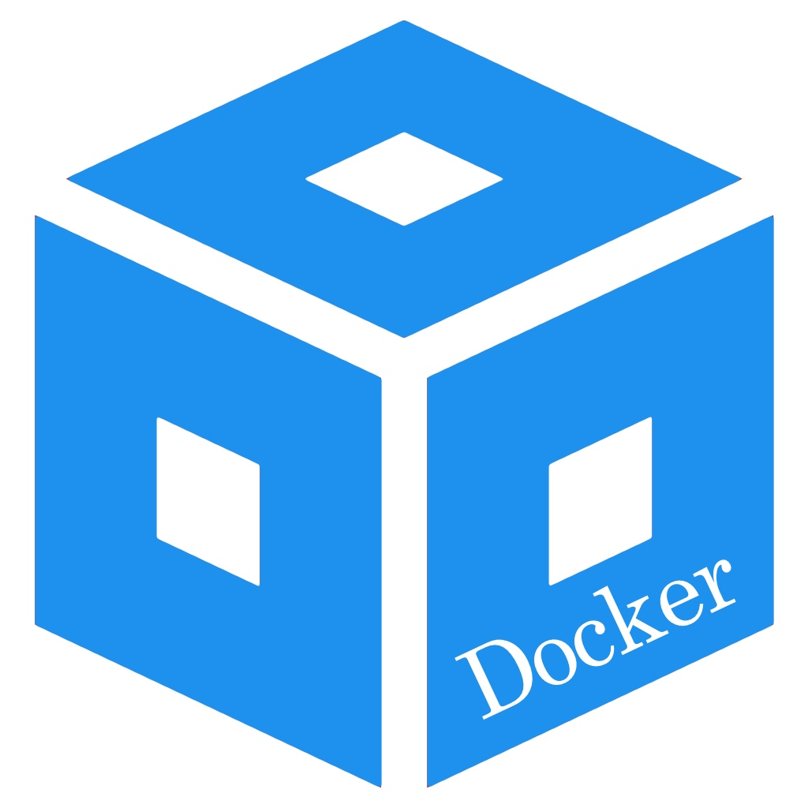

# docker-ccstudio-ide

The [`docker-ccstudio-ide`](https://github.com/uoohyo/docker-ccstudio-ide) Docker image provides a CI/CD environment for projects developed in the Code Composer Studio IDE from Texas Instruments. Code Composer Studio is an integrated development environment (IDE) for TI's microcontrollers and processors, comprising a suite of tools used to develop and debug embedded applications.

## Build

To create the [`uoohyo/ccstudio-ide`](https://hub.docker.com/r/uoohyo/ccstudio-ide) Docker image, execute the following command inside the `docker-ccstudio-ide` directory:

    docker build -t uoohyo/ccstudio-ide .

## Run

Pull the [`uoohyo/ccstudio-ide`](https://hub.docker.com/r/uoohyo/ccstudio-ide) image from Docker Hub using the following command:

    docker pull uoohyo/ccstudio-ide:latest

Run the pulled image. By default, the image is configured with the latest version of [Code Composer Studio](https://www.ti.com/tool/CCSTUDIO) available at the time of the image update. The development tools are set to support `C2000 real-time MCUs`:

    docker run -it uoohyo/ccstudio-ide:latest

### Environments

You can modify environment variables when running the [`uoohyo/ccstudio-ide`](https://hub.docker.com/r/uoohyo/ccstudio-ide) image to specify the version and development tools configuration of Code Composer Studio to be installed. Here is how you can customize it:

    docker run -it \
    -e MAJOR_VER=20 \
    -e MINOR_VER=2 \
    -e PATCH_VER=0 \
    -e BUILD_VER=00012 \
    -e COMPONENTS=PF_C28 \
    uoohyo/ccstudio-ide:latest

#### Version

The structure of the [Code Composer Studio](https://www.ti.com/tool/CCSTUDIO) version is as follows:

    <MAJOR_VER> . <MINOR_VER> . <PATCH_VER> . <BUILD_VER>

As of June 17, 2025, the latest released version of [Code Composer Studio](https://www.ti.com/tool/CCSTUDIO) is `20.2.0.00012`. The default environment variables are set accordingly

    ENV MAJOR_VER=20
    ENV MINOR_VER=2
    ENV PATCH_VER=0
    ENV BUILD_VER=00012

For the latest version information, visit [this link](https://www.ti.com/tool/download/CCSTUDIO).

#### Components

When installing [Code Composer Studio](https://www.ti.com/tool/CCSTUDIO), you can choose from various [Texas Instruments Inc.](https://www.ti.com/) product families. Below is a list of installable product families:

|Product family     |Description                                                                    |
|-------------------|-------------------------------------------------------------------------------|
|PF_MSP430          |MSP430 ultra-low power MCUs                                                    |
|PF_MSP432          |SimpleLink™ MSP432™ low power + performance MCUs                               |
|PF_CC2X            |SimpleLink™ CC13xx and CC26xx Wireless MCUs                                    |
|PF_CC3X            |SimpleLink™ Wi-Fi® CC32xx Wireless MCUs                                        |
|PF_CC2538          |CC2538 IEEE 802.15.4 Wireless MCUs                                             |
|PF_C28             |C2000 real-time MCUs                                                           |
|PF_TM4C            |TM4C12x ARM® Cortex®-M4F core-based MCUs                                       |
|PF_PGA             |PGA Sensor Signal Conditioners                                                 |
|PF_HERCULES        |Hercules™ Safety MCUs                                                          |
|PF_SITARA          |Sitara™ AM3x, AM4x, AM5x and AM6x MPUs (will also include AM2x for CCS 10.x)   |
|PF_SITARA_MCU      |Sitara™ AM2x MCUs (only supported in CCS 11.x and greater)                     |
|PF_OMAPL           |OMAP-L1x DSP + ARM9® Processor                                                 |
|PF_DAVINCI         |DaVinci (DM) Video Processors                                                  |
|PF_OMAP            |OMAP Processors                                                                |
|PF_TDA_DRA         |TDAx Driver Assistance SoCs & Jacinto DRAx Infotainment SoCs                   |
|PF_C55             |C55x ultra-low-power DSP                                                       |
|PF_C6000SC         |C6000 Power-Optimized DSP                                                      |
|PF_C66AK_KEYSTONE  |66AK2x multicore DSP + ARM® Processors & C66x KeyStone™ multicore DSP          |
|PF_MMWAVE          |mmWave Sensors                                                                 |
|PF_C64MC           |C64x multicore DSP                                                             |
|PF_DIGITAL_POWER   |UCD Digital Power Controllers                                                  |

Multiple product families can be installed by separating their names with a comma in the `COMPONENTS` variable. Here is an example that installs development tools for both PF_MSP430 and PF_CC2X:

    docker run -it
    -e COMPONENTS PF_MSP430, PF_CC2X
    uoohyo/ccstudio-ide:latest

## Usage

Once the image is running, you can add projects to the workspace and execute builds based on specific build options. Below are example commands to demonstrate these actions.

Import a project into the workspace:

    eclipse -noSplash -data <workspace_path> -application com.ti.ccstudio.apps.projectImport -ccs.location <project_path>
    
Build a project using specific configuration:

    eclipse -noSplash -data <workspace_path> -application com.ti.ccstudio.apps.projectBuild -ccs.projects <project_name> -ccs.configuration <build_name>

These commands utilize the `eclipse` executable to manage projects within the Code Composer Studio environment without the need for a graphical interface, making them ideal for automated environments such as continuous integration setups.

For more detailed commands and explanations, visit [this link](https://dev.ti.com/tirex/explore/node?node=AJpAFDF7v70N4B0-zFMXpw__FUz-xrs__LATEST).

## License

[MIT License](./LICENSE)

Copyright (c) 2024 [uoohyo](https://github.com/uoohyo)

Permission is hereby granted, free of charge, to any person obtaining a copy
of this software and associated documentation files (the "Software"), to deal
in the Software without restriction, including without limitation the rights
to use, copy, modify, merge, publish, distribute, sublicense, and/or sell
copies of the Software, and to permit persons to whom the Software is
furnished to do so, subject to the following conditions:

The above copyright notice and this permission notice shall be included in all
copies or substantial portions of the Software.

THE SOFTWARE IS PROVIDED "AS IS", WITHOUT WARRANTY OF ANY KIND, EXPRESS OR
IMPLIED, INCLUDING BUT NOT LIMITED TO THE WARRANTIES OF MERCHANTABILITY,
FITNESS FOR A PARTICULAR PURPOSE AND NONINFRINGEMENT. IN NO EVENT SHALL THE
AUTHORS OR COPYRIGHT HOLDERS BE LIABLE FOR ANY CLAIM, DAMAGES OR OTHER
LIABILITY, WHETHER IN AN ACTION OF CONTRACT, TORT OR OTHERWISE, ARISING FROM,
OUT OF OR IN CONNECTION WITH THE SOFTWARE OR THE USE OR OTHER DEALINGS IN THE
SOFTWARE.