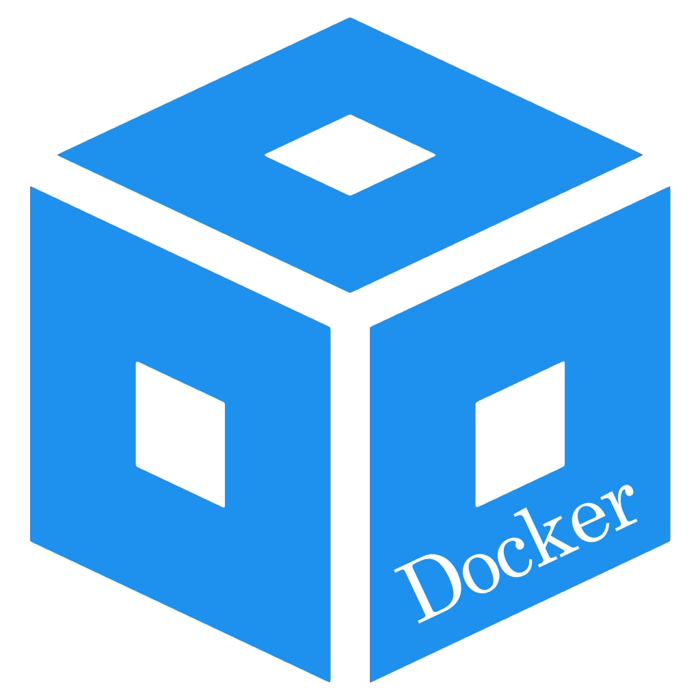

# docker-ccstudio-ide

<!-- markdownlint-disable MD033 -->
<table>
  <tr>
    <td></td>
    <td valign="top">
      <b>CCS™ Version Build Status</b>
      <table>
        <tr><th>Version</th><th>Status</th></tr>
<!-- VERSION_TABLE_START -->

        <tr><td>v20.5.1.00012</td><td></td></tr>
        <tr><td>v20.5.0.00028</td><td></td></tr>
        <tr><td>v20.4.1.00004</td><td></td></tr>
        <tr><td>v20.4.0.00013</td><td></td></tr>
        <tr><td>v20.3.1.00005</td><td></td></tr>
        <tr><td>v20.3.0.00014</td><td></td></tr>
<!-- VERSION_TABLE_END -->
        <tr><td colspan="2" align="center"><a href="docs/versions.md"><b>📋 See all versions →</b></a></td></tr>
      </table>
    </td>
  </tr>
</table>
<!-- markdownlint-enable MD033 -->

A Docker image providing a headless CI/CD environment for [Code Composer Studio (CCS)](https://www.ti.com/tool/CCSTUDIO), Texas Instruments' IDE for microcontrollers and processors. Each image ships with the CCS installer pre-extracted — no internet connection is required at runtime.

> **Note:** CCS is installed on first container start. Expect **~3–5 minutes** for the installation to complete.

## Quick Start

Pull a version-specific image from Docker Hub:

    docker pull uoohyo/ccstudio-ide:20.5.0.00028

Or use the latest:

    docker pull uoohyo/ccstudio-ide:latest

Run the container:

    docker run -it uoohyo/ccstudio-ide:20.5.0.00028

See [docs/versions.md](docs/versions.md) for all available versions.

## Configuration

### Components

Use the `COMPONENTS` environment variable to select which TI product families to install. Supported on **CCS v10 and above** — for v9 and below, all product families are installed regardless.

    docker run -it \
      -e COMPONENTS=PF_C28 \
      uoohyo/ccstudio-ide:20.5.0.00028

Multiple families can be specified with a comma:

    docker run -it \
      -e COMPONENTS="PF_MSP430,PF_CC2X" \
      uoohyo/ccstudio-ide:20.5.0.00028

| Product Family | Description |
| --- | --- |
| PF_MSP430 | MSP430 ultra-low power MCUs |
| PF_MSP432 | SimpleLink™ MSP432™ low power + performance MCUs |
| PF_CC2X | SimpleLink™ CC13xx and CC26xx Wireless MCUs |
| PF_CC3X | SimpleLink™ Wi-Fi® CC32xx Wireless MCUs |
| PF_CC2538 | CC2538 IEEE 802.15.4 Wireless MCUs |
| PF_C28 | C2000 real-time MCUs |
| PF_TM4C | TM4C12x ARM® Cortex®-M4F core-based MCUs |
| PF_PGA | PGA Sensor Signal Conditioners |
| PF_HERCULES | Hercules™ Safety MCUs |
| PF_SITARA | Sitara™ AM3x, AM4x, AM5x and AM6x MPUs (will also include AM2x for CCS 10.x) |
| PF_SITARA_MCU | Sitara™ AM2x MCUs (only supported in CCS 11.x and greater) |
| PF_OMAPL | OMAP-L1x DSP + ARM9® Processor |
| PF_DAVINCI | DaVinci (DM) Video Processors |
| PF_OMAP | OMAP Processors |
| PF_TDA_DRA | TDAx Driver Assistance SoCs & Jacinto DRAx Infotainment SoCs |
| PF_C55 | C55x ultra-low-power DSP |
| PF_C6000SC | C6000 Power-Optimized DSP |
| PF_C66AK_KEYSTONE | 66AK2x multicore DSP + ARM® Processors & C66x KeyStone™ multicore DSP |
| PF_MMWAVE | mmWave Sensors |
| PF_C64MC | C64x multicore DSP |
| PF_DIGITAL_POWER | UCD Digital Power Controllers |

## Usage

Once the container is running and installation is complete, use CLI commands to manage and build projects.

**CCS v20 and above (Theia-based):**

Import a project into the workspace:

    ccs-server-cli -noSplash -workspace <workspace_path> -application com.ti.ccs.apps.importProject -ccs.location <project_path>

Build a project:

    ccs-server-cli -noSplash -workspace <workspace_path> -application com.ti.ccs.apps.buildProject -ccs.projects <project_name> -ccs.configuration <build_name>

**CCS v12 and below (Eclipse-based):**

Import a project into the workspace:

    eclipse -noSplash -data <workspace_path> -application com.ti.ccstudio.apps.projectImport -ccs.location <project_path>

Build a project:

    eclipse -noSplash -data <workspace_path> -application com.ti.ccstudio.apps.projectBuild -ccs.projects <project_name> -ccs.configuration <build_name>

For more commands, see the [CCS command-line documentation](https://software-dl.ti.com/ccs/esd/documents/users_guide_ccs_20.0.0/ccs_project-command-line.html).

## License

[MIT License](./LICENSE)

Copyright (c) 2024-2026 [uoohyo](https://github.com/uoohyo)

Permission is hereby granted, free of charge, to any person obtaining a copy of this software and associated documentation files (the "Software"), to deal in the Software without restriction, including without limitation the rights to use, copy, modify, merge, publish, distribute, sublicense, and/or sell copies of the Software, and to permit persons to whom the Software is furnished to do so, subject to the following conditions:

The above copyright notice and this permission notice shall be included in all copies or substantial portions of the Software.

THE SOFTWARE IS PROVIDED "AS IS", WITHOUT WARRANTY OF ANY KIND, EXPRESS OR IMPLIED, INCLUDING BUT NOT LIMITED TO THE WARRANTIES OF MERCHANTABILITY, FITNESS FOR A PARTICULAR PURPOSE AND NONINFRINGEMENT. IN NO EVENT SHALL THE AUTHORS OR COPYRIGHT HOLDERS BE LIABLE FOR ANY CLAIM, DAMAGES OR OTHER LIABILITY, WHETHER IN AN ACTION OF CONTRACT, TORT OR OTHERWISE, ARISING FROM, OUT OF OR IN CONNECTION WITH THE SOFTWARE OR THE USE OR OTHER DEALINGS IN THE SOFTWARE.
